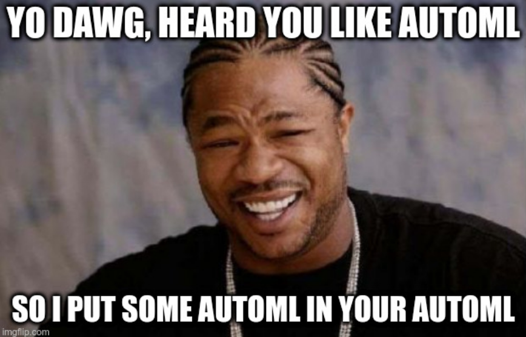

# AutoAutoML
A tool to help explore and run automl experiments automatically.

**Status:** Ultra Alpha!

# TODOs

- clean containers
- add container metadata (which problem types it supports)
- add main autoautoml run script

# Commands

build a container:

```
make build CONTAINER=autosklearn
```

test a container:

```
make test CONTAINER=autosklearn
```

manual run:

```
 python bin/run_manual.py containers/auto-keras/test_autokeras.json

 **Note** To use aws related resources (S3) you need to set the AWS credentials as environment variables in the job config. See `job_configs/titanic_docker_s3.json` as an example.
```

# How to add a container
AutoAutoML uses docker as an easy way to standardize the wildly varied requirements of each automl library

The structure to add a compatible container is as follows:

```
- containers
|--->CONTAINER
|-------->Dockerfile
|-------->project.py
|-------->test_CONTAINER.json
```

Where:
-  `CONTAINER` is the name of the new library you would like to implement a container for (for example, autosklearn),
- `Dockerfile` is the dockerfile to build the container.  The container needs to be built from the core container `autoautoml-core`
- `project.py` is the file where you setup the `AutoML` class that will be instantiated and run
- `test_CONTAINER.json` is a json file to run a test job. The autoautoml-core container contains (lol) some test data (titanic dataset for example) to test containers.

# Containers

**autoautoml-core**
This is the container with core functionalities, not meant for direct use

**autokeras**
https://autokeras.com

**autosklearn**
https://automl.github.io/auto-sklearn/master/

**h20**
https://github.com/h2oai/h2o-3

**ludwig**
https://github.com/uber/ludwig

**mlbox (WIP)**
https://mlbox.readthedocs.io

*Note:* It uses a forked version so the `Predictor` can predict on out of sample data

**pycaret**
https://github.com/pycaret/pycaret

**tpot**
https://http://epistasislab.github.io/tpot
